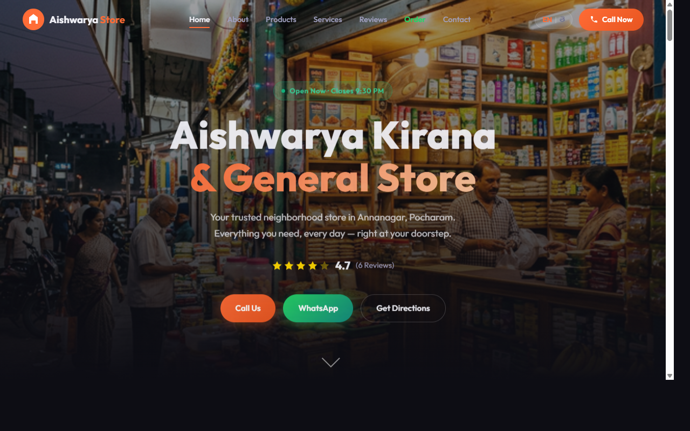

# Aishwarya Kirana & General Store Website

This repository contains the source code for a modern, responsive website built for **Aishwarya Kirana & General Store**, a trusted neighborhood grocery store located in Annanagar, Pocharam, Secunderabad.

## Features

- **Responsive Design**: Built to look great and function perfectly on mobile, tablet, and desktop devices.
- **WhatsApp Integration**: Includes an order form that directly links to WhatsApp, sending a pre-filled message with order details to the store owner.
- **Service Listings**: Showcases products ranging from daily groceries to specific services like LPG Gas filling and Xerox.
- **Interactive Store Hours**: Displays peak hours for the store.
- **Embedded Google Maps**: Provides easy navigation for customers to find the physical store.
- **Floating Action Buttons**: Quick-access buttons for Calling or WhatsApp messaging.

## Tech Stack

- **HTML5** for structure
- **CSS3** (Vanilla) for styling, including modern features like flexbox, grid, and CSS variables
- **Vanilla JavaScript** for interactive components (menus, order form validation, language toggles, etc.)

## How to run locally

1. Clone this repository.
2. Open `index.html` in your favorite web browser perfectly—no build step required!
